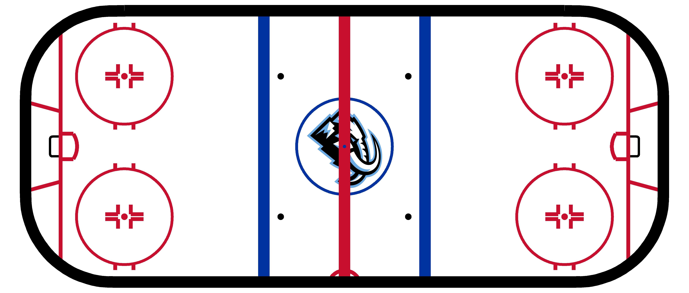
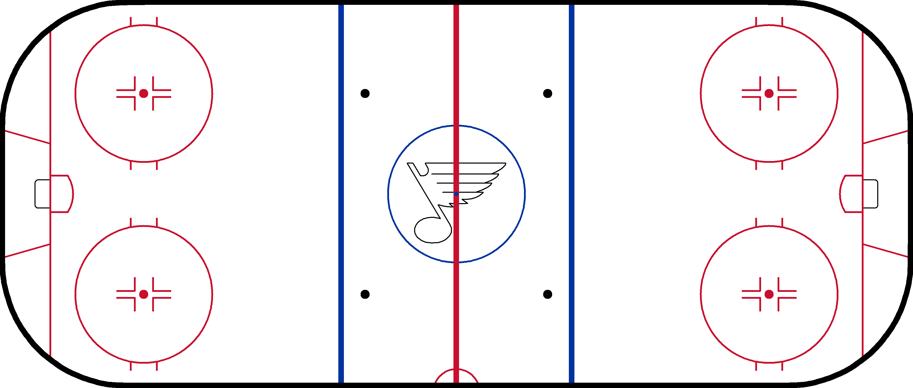

``` r
packageVersion("ggforce")
#> [1] '0.5.0'
```

# **NHL.Rink**

------------------------------------------------------------------------

## **Installation**

<!-- From CRAN (when published) -->
<!-- install.packages("NHL.Rink") -->

``` r
# install.packages("devtools")      
install.packages("darkghastful/NHL.Rink")
```

------------------------------------------------------------------------

## **Quick Start**

### **Load the package**

``` r
library(NHL.Rink)
```

------------------------------------------------------------------------

<!-- ### **Choose a team** -->
<!-- ```{r} -->
<!-- NHL.teams()[c(26, 22, 31),]  # Use NHL.teams() for full list -->
<!-- ``` -->
<!-- --- -->

### **Generate a rink with a team logo.**

``` r
rink("UTA") # Use rink() for empty rink
```



------------------------------------------------------------------------

### **NHL rink with a blues logo generated using calculated equations.**

``` r
blues.note.plot(rink = TRUE)
```



------------------------------------------------------------------------

## **Functions**

### `rink(team = NA)`

Generates an NHL regulation rink plot with an optional team logo.

- **Arguments**
  - `team` — Team name, tri-code, or ID (e.g. `"STL"`).  
- **Returns**
  - A **ggplot** object with the rink (and logo if specified).

------------------------------------------------------------------------

### `blues.note.plot(rink = FALSE, save = FALSE)`

Calculates the equations for a Blues note logo and optionally overlays
it on a rink.

- **Arguments**
  - `rink` — Logical; if `TRUE`, overlays the note on a rink.  
  - `save` — Logical; if `TRUE`, saves as `blues.note.plot.rds` or
    `blues.rink.plot.rds`.  
- **Returns**
  - A **ggplot** object of the note (and rink if `rink = TRUE`).

------------------------------------------------------------------------

### `rink.logo(team)`

Queries and prepares a **grob** of a team logo.

- **Arguments**
  - `team` — Team name, tri-code, or ID (e.g. `"STL"`).  
- **Returns**
  - A **grob** that can be layered onto any ggplot.

------------------------------------------------------------------------

## **Dependencies**

- **bqutils**  
- **ggplot2** ≥ 3.5.2  
- **ggforce**  
- **rsvg**  
- **magick**  
- **grid**  
- **stringr**  
- **magrittr**  
- **scales**

------------------------------------------------------------------------

## **License**

GPL-3.0 license © Bailey Quinn
